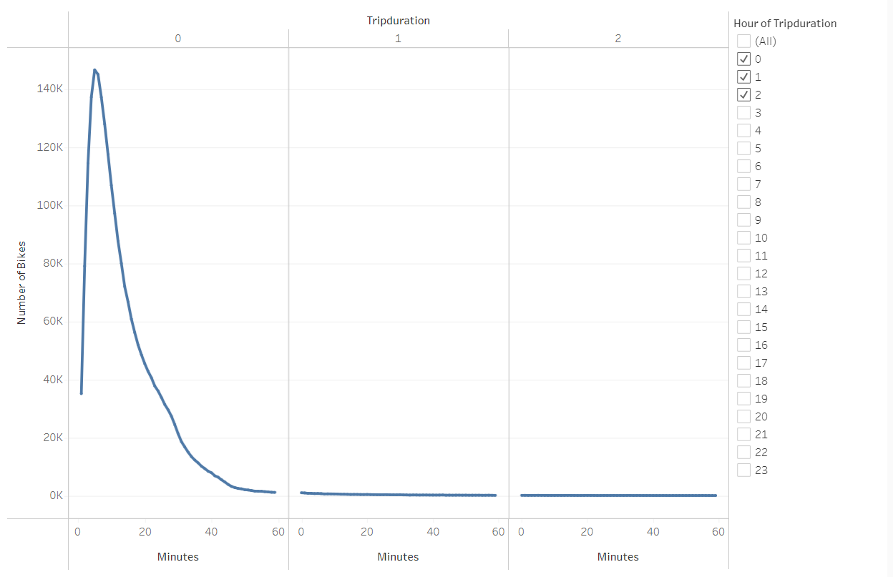
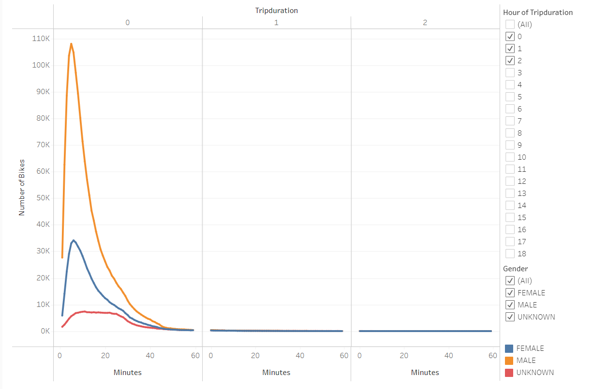
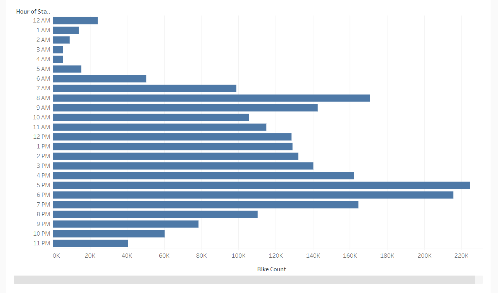
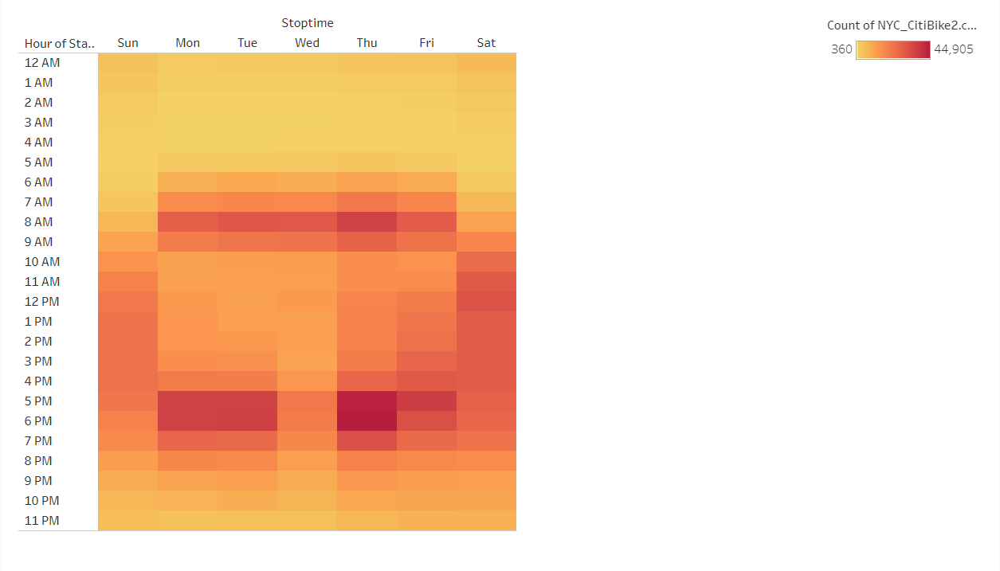
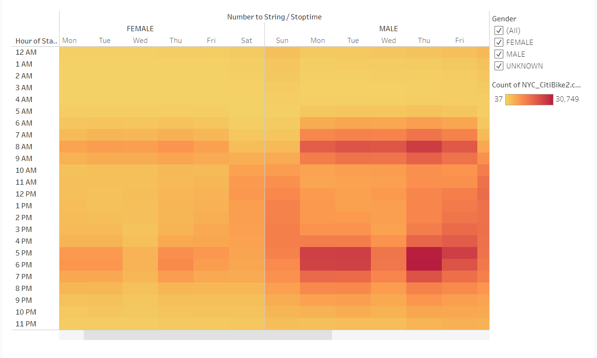
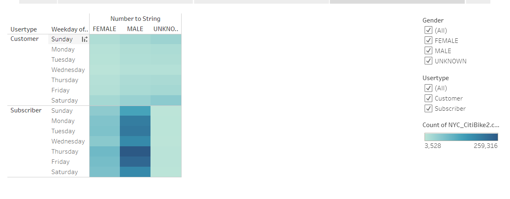
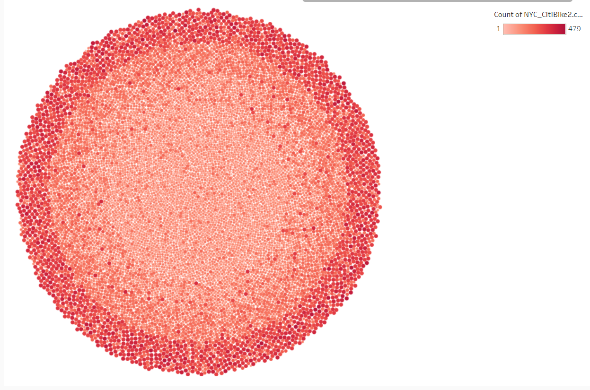

# Bikesharing

## Overview

Tableau Stories published using Bikeshare user data for the month of August 2009, provided by Citi Group for the city of New York. 

[Link to Dashboard](https://public.tableau.com/views/CitiBikeChallenge_16435815931090/NYCCitiBike?:language=en-US&:display_count=n&:origin=viz_share_link)

Jupyter Notebook and pandas was used for converting the "Tripduration" column into datetime format.

```python
#  Convert the 'tripduration' column to datetime datatype.

df['tripduration'] = pd.to_datetime(df['tripduration'], unit= 's')

```

Analysis for possible implementations in other cities (such as Des Moines) includes:

- A line graph displaying the number of bikes checked out by duration for all users, and the graph can be filtered by the hour
- A line graph displaying the number of bikes that are checked out by duration for each gender by the hour, and the graph can be filtered by the hour and gender
- A bar graph diplaying the number of bike trips for each our during the month of August
- A heatmap showing the number of bike trips for each hour of each day of the week 
- A heatmap showing the number of bike trips by gender for each hour of each day of the week, and the heatmap can be filtered by gender 
- A heatmap showing the number of bike trips for each type of user and gender for each day of the week, and you can only filter by user and gender
- A packed cicle chart that shows bike IDs dispersed based on use count

### Resources

- [Tableau Desktop Public Edition v. 2021.4.3](https://www.tableau.com/support?build=20214.22.0108.1039&edition=public&lang=en-us&platform=windows&version=2021.4)
- [CitiBike data provided by Citi for the month of August, 2009](https://ride.citibikenyc.com/system-data)
- [Python 3.7.10](https://docs.python.org/3.7/)
- [Anaconda 4.10.1](https://docs.conda.io/projects/conda/en/latest/glossary.html#conda-environment)
- [Jupyter Notebook 6.3.0](https://jupyter-notebook.readthedocs.io/en/stable/index.html)

## Results

We see the peak bike numbers during the first 5 minutes of the first hour



Breakdown of the peak by gender shows males are the highest at 108,087, Females 34,151, and Unknown around 7,389.



Trips peak between the hours of 8AM-10AM and 5PM-8PM.



Thursdays have the most active hours compared to other weekdays, bu the weekends have longer periods of more prolonged activity. 



Trips peaked at similar times for male and female genders. Males took more trips throughout the week.



When comparing subscriber to customer users, subscribers participated more often. Males participated more than any other gender. 



This is a breakdown of bike usage. The larger and darker the data point, the more used the bike is (and ought to be maintained more regularly)



## Summary 

These analysis show that majority who participated in the bikeshare program during the month of August 2009 were male subscribers, typically on Thursday evenings. 224,566 bikes used in the 5PM hour.  While Thursday was the most popular weekday among all gender groups, males favored it over females. In general, females are not as paricipatory while checking out, using, or returning the bikes.

A more targeted analysis could help increase female user participation in the bikeshare program. We can use these data to further explore female-specific metrics, such as amount of female users, ride counts, trip durations, age groups, etc.   
